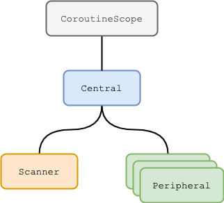

![badge][badge-android]
![badge][badge-js]
![badge][badge-mac]

# Kable

**K**otlin **A**synchronous **B**luetooth **L**ow **E**nergy provides a simple Coroutines-powered API for interacting
with Bluetooth Low Energy devices.

## Background

Bluetooth Low Energy devices may operate as one of the following roles:

- **Central**: The central is often a larger and higher powered device such as a computer or mobile phone.
  The central scans for and initiates connections with remote peripherals that are advertising.
- **Peripheral**: Peripherals are commonly smaller, lower powered devices such as heart rate monitors and other sensors.
  They will advertise their presence so that a central can find and connect to them.

## Central

The `Central` class is the primary entry point and provides capabilities for scanning for nearby peripherals.
To create a `Central`, simply call the `CoroutineScope.central` extension function.

### Android

On Android, the `central` extension function requires an Android `Context` argument:

```kotlin
val central = scope.central(context)
```

### JavaScript & Apple

For both JavaScript and Apple-based targets, the `central` extension function is called without arguments:

```kotlin
val central = scope.central()
```

## Scanning

To scan for nearby peripherals, acquire a `Scanner` from the `Central` via the `scanner` function. To begin scanning,
simply collect from the `Scanner`'s `peripheral` `Flow`. The `peripheral` `Flow` provides a stream of `Advertisement`
objects representing advertisements seen from nearby peripherals. When `Flow` collection is terminated, scanning will
stop. A `Flow` terminal operator (such as [`first`]) may be used to scan until an advertisement is found which matches a
desired predicated.

Using an `Advertisement` object, you can acquire a `Peripheral` using the `Central.peripheral` function.

### Android & Apple

```kotlin
val scanner = central.scanner()
val advertisement = scanner.peripherals.first { it.name?.startsWith("Example") }
val peripheral = central.peripheral(advertisement)
```

### JavaScript

On JavaScript, the standard paradigm is to request a specific peripheral rather than processing a stream of
advertisements. Criterium (`Options`) such as expected service UUIDs on the peripheral and/or the peripheral's name may
be specified. When `requestPeripheral` is called with the specified options, the browser shows the user a list of
peripherals matching the criterium. The peripheral chosen by the user is then returned (as a `Peripheral` object).

```kotlin
val options = Options(
    optionalServices = arrayOf(
        "f000aa80-0451-4000-b000-000000000000",
        "f000aa81-0451-4000-b000-000000000000"
    ),
    filters = arrayOf(
        NamePrefix("Example")
    )
)
val peripheral = central.requestPeripheral(options)
```

_Scanning for all nearby peripherals is supported, but is only available on Chrome 79+ with "Experimental Web Platform
features" enabled via:_ `chrome://flags/#enable-experimental-web-platform-features`

## Peripheral

`Peripheral` objects represent actions that can be performed against a remote peripheral, such as connection handling
and I/O operations. The `Peripheral` API is the same for all platforms.

### Connectivity

Once a `Peripheral` object is acquired, a connection can be established via the `connect` function. The `connect` method
suspends until a connection is established and ready (or a failure occurs). A connection is considered ready when
connected, services have been discovered and observations (if any) have been re-wired. _Service discovery occurs
automatically upon connection._

Multiple concurrent calls to `connect` will all suspend until connection is ready.

```kotlin
peripheral.connect()
```

To disconnect, the `disconnect` function will disconnect an active connection, or cancel and in-flight connection
attempt. The `disconnect` function suspends until the peripheral has settled on a disconnected state.

```kotlin
peripheral.disconnect()
```

_If the underlying subsystem fails to deliver the disconnected state then the `disconnect` call could potentially stall
indefinitely. To prevent this (and ensure underlying resources are cleaned up in a timely manner) it is recommended that
`disconnect` be wrapped with a timeout, for example:_

```kotlin
withTimeoutOrNull(5_000L) {
    peripheral.disconnect()
}
```

#### State

The connection state of a `Peripheral` can be monitored via its `state` `Flow`.

```kotlin
peripheral.state.collect { state ->
    // Display and/or process the connection state.
}
```

The `state` will typically transition through the following `State`s:


_`Disconnecting` state only occurs on Android platform. JavaScript and Apple-based platforms transition directly from
`Connected` to `Disconnected` (upon calling `disconnect` function, or when a connection is dropped)._

### I/O

Bluetooth Low Energy devices are organized into a tree-like structure of services, characteristics and descriptors;
whereas characteristics and descriptors have the capability of being read from, or written to.

For example, a peripheral might have the following structure:

- Service S1 (`00001815-0000-1000-8000-00805f9b34fb`)
    - Characteristic C1
        - Descriptor D1
        - Descriptor D2
    - Characteristic C2 (`00002a56-0000-1000-8000-00805f9b34fb`)
        - Descriptor D3 (`00002902-0000-1000-8000-00805f9b34fb`)
- Service S2
    - Characteristic C3

To access a characteristic or descriptor, use the `charactisticOf` or `descriptorOf` functions, respectively.

In the above example, to access "Descriptor D2":

```kotlin
val descriptor = descriptorOf(
    service = "00001815-0000-1000-8000-00805f9b34fb",
    characteristic = "00002a56-0000-1000-8000-00805f9b34fb",
    descriptor = "00002902-0000-1000-8000-00805f9b34fb"
)
```

Once connected, data can be read from, or written to, characteristics and/or descriptors via `read` and `write`
functions.

_The `read` and `write` functions throw `NotReadyException` until a connection is established._

```kotlin
val data = peripheral.read(characteristic)

peripheral.write(descriptor, byteArrayOf(1, 2, 3))
```

### Notifications

Bluetooth Low Energy provides the capability of subscribing to characteristic changes by means of notifications, whereas
a characteristic change on a connected peripheral is "pushed" to the central via a characteristic notification which
carries the new value of the characteristic.

Characteristic change notifications can be observed/subscribed to via the `observe` function which returns a `Flow` of
the new characteristic data.

```kotlin
val observation = peripheral.observe(characteristic)
observation.collect { data ->
    // Process data.
}
```

The `observe` function can be called (and its returned `Flow` can be collected) prior to a connection being established.
Once a connection is established then characteristic changes will stream from the `Flow`. If the connection drops, the
`Flow` will remain active, and upon reconnecting it will resume streaming characteristic changes.

Failures related to notifications are propagated via `connect` if the `observe` `Flow` is collected prior to a
connection being established. If a connection is already established when an `observe` `Flow` is beginning to be
collected, then notification failures are propagated via the `observe` `Flow`.

## Structured Concurrency

Central and peripheral objects/connections are scoped to a [Coroutine scope]. When creating a `Central`, the
`CoroutineScope.central` function is used, which scopes the returned `Central` to the `CoroutineScope` receiver. If the
`CoroutineScope` receiver is cancelled then the `Central` (and all its children) will be disposed.



`Scanner` and `Peripheral` objects are also scoped (to the `Central` object used to acquire them). When their parent
`Central` is disposed (via their parent `Central`'s `CoroutineScope` being cancelled) then they too will be disposed.

This allows any scans to be stopped, connections to be closed and resources to be released when the root
`CoroutineScope` (that the `Central` is scoped to) is cancelled:

```kotlin
val central = scope.central()
val scanner = central.scanner()
scanner.peripherals
    .filter { advertisement -> advertisement.name?.startsWith("Example") }
    .map { advertisement -> central.peripheral(advertisement) }
    .onEach { peripheral -> peripheral.connect() }
    .launchIn(scope)

delay(60_000L)
scope.cancel() // All `peripherals` will implicitly disconnect and be disposed.
```

## Setup

### Gradle

[](https://maven-badges.herokuapp.com/maven-central/com.juul.kable/core)

Kable can be configured via Gradle Kotlin DSL (when using the Kotlin `multiplatform` plugin) as follows:

```kotlin
plugins {
    id("com.android.application") // or id("com.android.library")
    kotlin("multiplatform")
}

repositories {
    jcenter() // or mavenCentral()
}

kotlin {
    android()
    js().browser() // and/or js().node()
    macosX64()

    sourceSets {
        val commonMain by getting {
            dependencies {
                implementation("com.juul.kable:core:$version")
            }
        }
    }
}

android {
    // ...
}
```

_Note that Apple-based targets (e.g. `macosX64`) require [Coroutines with multithread support for Kotlin/Native] (more
specifically: Coroutines library artifacts that are suffixed with `-native-mt`)._


[`first`]: https://kotlin.github.io/kotlinx.coroutines/kotlinx-coroutines-core/kotlinx.coroutines.flow/first.html
[Coroutines with multithread support for Kotlin/Native]: https://github.com/Kotlin/kotlinx.coroutines/issues/462
[Coroutine scope]: https://kotlinlang.org/docs/reference/coroutines/coroutine-context-and-dispatchers.html#coroutine-scope

[badge-android]: http://img.shields.io/badge/platform-android-6EDB8D.svg?style=flat
[badge-ios]: http://img.shields.io/badge/platform-ios-CDCDCD.svg?style=flat
[badge-js]: http://img.shields.io/badge/platform-js-F8DB5D.svg?style=flat
[badge-jvm]: http://img.shields.io/badge/platform-jvm-DB413D.svg?style=flat
[badge-linux]: http://img.shields.io/badge/platform-linux-2D3F6C.svg?style=flat
[badge-windows]: http://img.shields.io/badge/platform-windows-4D76CD.svg?style=flat
[badge-mac]: http://img.shields.io/badge/platform-macos-111111.svg?style=flat
[badge-watchos]: http://img.shields.io/badge/platform-watchos-C0C0C0.svg?style=flat
[badge-tvos]: http://img.shields.io/badge/platform-tvos-808080.svg?style=flat
[badge-wasm]: https://img.shields.io/badge/platform-wasm-624FE8.svg?style=flat
