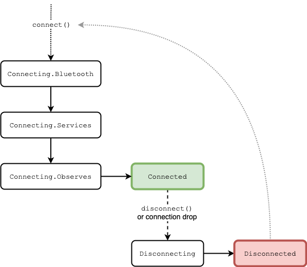

![badge][badge-android]
![badge][badge-ios]
![badge][badge-js]
![badge][badge-mac]
[![Slack](https://img.shields.io/badge/Slack-%23juul--libraries-ECB22E.svg?logo=data:image/svg+xml;base64,PHN2ZyB2aWV3Qm94PSIwIDAgNTQgNTQiIHhtbG5zPSJodHRwOi8vd3d3LnczLm9yZy8yMDAwL3N2ZyI+PGcgZmlsbD0ibm9uZSIgZmlsbC1ydWxlPSJldmVub2RkIj48cGF0aCBkPSJNMTkuNzEyLjEzM2E1LjM4MSA1LjM4MSAwIDAgMC01LjM3NiA1LjM4NyA1LjM4MSA1LjM4MSAwIDAgMCA1LjM3NiA1LjM4Nmg1LjM3NlY1LjUyQTUuMzgxIDUuMzgxIDAgMCAwIDE5LjcxMi4xMzNtMCAxNC4zNjVINS4zNzZBNS4zODEgNS4zODEgMCAwIDAgMCAxOS44ODRhNS4zODEgNS4zODEgMCAwIDAgNS4zNzYgNS4zODdoMTQuMzM2YTUuMzgxIDUuMzgxIDAgMCAwIDUuMzc2LTUuMzg3IDUuMzgxIDUuMzgxIDAgMCAwLTUuMzc2LTUuMzg2IiBmaWxsPSIjMzZDNUYwIi8+PHBhdGggZD0iTTUzLjc2IDE5Ljg4NGE1LjM4MSA1LjM4MSAwIDAgMC01LjM3Ni01LjM4NiA1LjM4MSA1LjM4MSAwIDAgMC01LjM3NiA1LjM4NnY1LjM4N2g1LjM3NmE1LjM4MSA1LjM4MSAwIDAgMCA1LjM3Ni01LjM4N20tMTQuMzM2IDBWNS41MkE1LjM4MSA1LjM4MSAwIDAgMCAzNC4wNDguMTMzYTUuMzgxIDUuMzgxIDAgMCAwLTUuMzc2IDUuMzg3djE0LjM2NGE1LjM4MSA1LjM4MSAwIDAgMCA1LjM3NiA1LjM4NyA1LjM4MSA1LjM4MSAwIDAgMCA1LjM3Ni01LjM4NyIgZmlsbD0iIzJFQjY3RCIvPjxwYXRoIGQ9Ik0zNC4wNDggNTRhNS4zODEgNS4zODEgMCAwIDAgNS4zNzYtNS4zODcgNS4zODEgNS4zODEgMCAwIDAtNS4zNzYtNS4zODZoLTUuMzc2djUuMzg2QTUuMzgxIDUuMzgxIDAgMCAwIDM0LjA0OCA1NG0wLTE0LjM2NWgxNC4zMzZhNS4zODEgNS4zODEgMCAwIDAgNS4zNzYtNS4zODYgNS4zODEgNS4zODEgMCAwIDAtNS4zNzYtNS4zODdIMzQuMDQ4YTUuMzgxIDUuMzgxIDAgMCAwLTUuMzc2IDUuMzg3IDUuMzgxIDUuMzgxIDAgMCAwIDUuMzc2IDUuMzg2IiBmaWxsPSIjRUNCMjJFIi8+PHBhdGggZD0iTTAgMzQuMjQ5YTUuMzgxIDUuMzgxIDAgMCAwIDUuMzc2IDUuMzg2IDUuMzgxIDUuMzgxIDAgMCAwIDUuMzc2LTUuMzg2di01LjM4N0g1LjM3NkE1LjM4MSA1LjM4MSAwIDAgMCAwIDM0LjI1bTE0LjMzNi0uMDAxdjE0LjM2NEE1LjM4MSA1LjM4MSAwIDAgMCAxOS43MTIgNTRhNS4zODEgNS4zODEgMCAwIDAgNS4zNzYtNS4zODdWMzQuMjVhNS4zODEgNS4zODEgMCAwIDAtNS4zNzYtNS4zODcgNS4zODEgNS4zODEgMCAwIDAtNS4zNzYgNS4zODciIGZpbGw9IiNFMDFFNUEiLz48L2c+PC9zdmc+&labelColor=611f69)](https://kotlinlang.slack.com/messages/juul-libraries/)

# Kable

**K**otlin **A**synchronous **B**luetooth **L**ow **E**nergy provides a simple Coroutines-powered API for interacting
with Bluetooth Low Energy devices.

Usage is demonstrated with the [SensorTag sample app].

## Scanning

To scan for nearby peripherals, the [`Scanner`] provides an [`advertisements`] [`Flow`] which is a stream of
[`Advertisement`] objects representing advertisements seen from nearby peripherals. [`Advertisement`] objects contain
information such as the peripheral's name and RSSI (signal strength).

The [`Scanner`] may be configured via the following DSL (shown are defaults, when not specified):

```kotlin
val scanner = Scanner {
    filters {
        match {
            name = Filter.Name.Exact("My device")
        }
    }
    logging {
        engine = SystemLogEngine
        level = Warnings
        format = Multiline
    }
}
```

Scan results can be filtered by providing a list of [`Filter`]s via the `filters` DSL.
The following filters are supported:

| Filter             | Android | Apple | JavaScript |
|--------------------|:-------:|:-----:|:----------:|
| `Service`          |   ✓✓    |  ✓✓*  |     ✓✓     |
| `Name`             |   ✓✓    |   ✓   |     ✓✓     |
| `NamePrefix`       |    ✓    |   ✓   |     ✓✓     |
| `Address`          |   ✓✓    |       |            |
| `ManufacturerData` |   ✓✓    |   ✓   |     ✓✓     |

✓✓ = Supported natively  
✓ = Support provided by Kable via flow filter  
✓✓* = Supported natively if the only filter type used, otherwise falls back to flow filter  

_When a filter is supported natively, the system will often be able to perform scan optimizations. If feasible, it is
recommended to provide only `Filter.Service` filters (and at least one) — as it is natively supported on all platforms._

When filters are specified, only [`Advertisement`]s that match at least one [`Filter`] will be emitted. For example, if
you had the following peripherals nearby when performing a scan:

| ID | Name        | Services                                                                           |
|:--:|-------------|------------------------------------------------------------------------------------|
| D1 | "SensorTag" | `0000aa80-0000-1000-8000-00805f9b34fb`                                             |
| D2 |             | `f484e2db-2efa-4b58-96be-f89372a3ef82`                                             |
| D3 | "Example"   | `8d7798c7-15bd-493f-a935-785305946870`,<br/>`67bebb9e-6372-4de6-a7bf-e0384583929e` |

To have peripherals D1 and D3 emitted during a scan, you could use the following `filters`:

```kotlin
val scanner = Scanner {
    filters {
        match {
            services = listOf(uuidFrom("0000aa80-0000-1000-8000-00805f9b34fb")) // SensorTag
        }
        match {
            name = Filter.Name.Prefix("Ex")
        }
    }
}
```

Scanning begins when the [`advertisements`] [`Flow`] is collected and stops when the [`Flow`] collection is terminated.
A [`Flow`] terminal operator (such as [`first`]) may be used to scan until (for example) the first advertisement is
found matching the specified filters: 

```kotlin
val advertisement = Scanner {
    filters {
        match {
            name = Filter.Name.Exact("Example")
        }
    }
}.advertisements.first()
```

### Android

Android offers additional settings to customize scanning. They are available via the `scanSettings` property in the
[`Scanner`] builder DSL. Simply set `scanSettings` property to an Android [`ScanSettings`] object, for example:

```kotlin
val scanner = Scanner {
    scanSettings = ScanSettings.Builder()
        .setScanMode(ScanSettings.SCAN_MODE_LOW_LATENCY)
        .build()
}
```

_The `scanSettings` property is only available on Android and is considered a Kable obsolete API, meaning it will be
removed when a DSL specific API becomes available._

### JavaScript

_Scanning for nearby peripherals is supported, but only available on Chrome 79+ with "Experimental Web Platform
features" enabled via:_ `chrome://flags/#enable-experimental-web-platform-features`

## Peripheral

Once an [`Advertisement`] is obtained, it can be converted to a [`Peripheral`] via the [`CoroutineScope.peripheral`]
extension function. [`Peripheral`] objects represent actions that can be performed against a remote peripheral, such as
connection handling and I/O operations.

```kotlin
val peripheral = scope.peripheral(advertisement)
```

Note that if the scope is closed, the peripheral is automatically disconnected. Ensure that the lifetime of the used
scope matches the required lifetime of the peripheral connection. See more details about this in the [Structured
Concurrency](#structured-concurrency) section below.

### Configuration

To configure a `peripheral`, options may be set in the builder lambda:

```kotlin
val peripheral = scope.peripheral(advertisement) {
    // Set peripheral configuration.
}
```

#### Logging

By default, Kable only logs a small number of warnings when unexpected failures occur. To aid in debugging, additional
logging may be enabled and configured via the `logging` DSL, for example:

```kotlin
val peripheral = scope.peripheral(advertisement) {
    logging {
        level = Events // or Data
    }
}
```

The available log levels are:

- `Warnings`: Logs warnings when unexpected failures occur _(default)_
- `Events`: Same as `Warnings` plus logs all events (e.g. writing to a characteristic)
- `Data`: Same as `Events` plus string representation of I/O data

Available logging settings are as follows (all settings are optional; shown are defaults, when not specified):

```kotlin
val peripheral = scope.peripheral(advertisement) {
    logging {
        engine = SystemLogEngine
        level = Warnings
        format = Multiline
        data = Hex
    }
}
```

The format of the logs can be either `Compact` (on a single line per log) or `Multiline` (spanning multiple lines for
details):

| `Compact` | `Multiline` _(default)_ |
|-----------|-------------------------|
| <pre>example message(detail1=value1, detail2=value2, ...)</pre> | <pre>example message<br/>  detail1: value1<br/>  detail2: value2<br/>  ...</pre> |

Display format of I/O data may be customized, either by configuring the `Hex` representation, or by providing a
`DataProcessor`, for example:

```kotlin
val peripheral = scope.peripheral(advertisement) {
    logging {
        data = Hex {
            separator = " "
            lowerCase = false
        }

        // or...

        data = DataProcessor { bytes, _, _, _, _ ->
            // todo: Convert `bytes` to desired String representation, for example:
            bytes.joinToString { byte -> byte.toString() } // Show data as integer representation of bytes.
        }
    }
}
```

_I/O data is only shown in logs when logging `level` is set to `Data`._

When logging, the identity of the peripheral is prefixed on log messages to differentiate messages when multiple
peripherals are logging. The identifier (for the purposes of logging) can be set via the `identifier` property:

```kotlin
val peripheral = scope.peripheral(advertisement) {
    logging {
        identifier = "Example"
    }
}
```

The default (when not specified, or set to `null`) is to use the platform specific peripheral identifier:

- Android: Hardware (MAC) address (e.g. "00:11:22:AA:BB:CC")
- Apple: The UUID associated with the peer
- JavaScript: A `DOMString` that uniquely identifies a device

#### Service Discovery

All platforms support an `onServicesDiscovered` action (that is executed after service discovery but before observations
are wired up):

```kotlin
val peripheral = scope.peripheral(advertisement) {
    onServicesDiscovered {
        // Perform any desired I/O operations.
    }
}
```

_Exceptions thrown in `onServicesDiscovered` are propagated to the `Peripheral`'s [`connect`] call._

### Android

On Android targets, additional configuration options are available (all configuration directives are optional):

```kotlin
val peripheral = scope.peripheral(advertisement) {
    autoConnectIf { false } // default
    onServicesDiscovered {
        requestMtu(...)
    }
    transport = Transport.Le // default
    phy = Phy.Le1M // default
}
```

#### `autoConnect`

Per the [`connectGatt`] documentation, `autoConnect` determines:

> Whether to directly connect to the remote device (`false`) or to automatically connect as soon as the remote device
> becomes available (`true`).

With respect to [`connect`]ing:

| `autoConnect` value | [`connect`] timeout |
|:-------------------:|:-------------------:|
|       `false`       |     ~30 seconds     |
|       `true`        |        Never        |

Per [answer](https://stackoverflow.com/a/50273724) to "What exactly does Android's Bluetooth `autoConnect` parameter do?":

> Direct connect has a different scan interval and scan window at a higher duty than auto connect, meaning it will
> dedicate more radio time to listen for connectable advertisements for the remote device, i.e. the connection will be
> established faster.

One possible strategy for a fast initial connection attempt that falls back to lower battery usage connection attempts is:

```kotlin
val autoConnect = MutableStateFlow(false)

val peripheral = scope.peripheral {
    autoConnectIf { autoConnect.value }
}

while (peripheral.state.value != Connected) {
    autoConnect.value = try {
        peripheral.connect()
        false
    } catch (e: Exception) {
        if (e is CancellationException) throw e
        true
    }
}
```

### JavaScript

On JavaScript, rather than processing a stream of advertisements, a specific peripheral can be requested using the
[`CoroutineScope.requestPeripheral`] extension function. Criteria ([`Options`]) such as expected service UUIDs on the
peripheral and/or the peripheral's name may be specified. When [`CoroutineScope.requestPeripheral`] is called with the
specified options, the browser shows the user a list of peripherals matching the criteria. The peripheral chosen by the
user is then returned (as a [`Peripheral`] object).

```kotlin
val options = Options {
    filters {
        match {
            name = Filter.Name.Prefix("Example")
        }
    }
    optionalServices = listOf(
        uuidFrom("f000aa80-0451-4000-b000-000000000000"),
        uuidFrom("f000aa81-0451-4000-b000-000000000000"),
    )
}
val peripheral = scope.requestPeripheral(options).await()
```

> After the user selects a device to pair with this origin, the origin is allowed to access any service whose UUID was
> listed in the services list in any element of `options.filters` or in `options.optionalServices`.
> 
> This implies that if developers filter just by name, they must use `optionalServices` to get access to any services.

— [Web Bluetooth: 4. Device Discovery](https://webbluetoothcg.github.io/web-bluetooth/#device-discovery)

## Connectivity

Once a [`Peripheral`] object is acquired, a connection can be established via the [`connect`] function. The [`connect`]
method suspends until a connection is established and ready (or a failure occurs). A connection is considered ready when
connected, services have been discovered, and observations (if any) have been re-wired. _Service discovery occurs
automatically upon connection._

_Multiple concurrent calls to [`connect`] will all suspend until connection is ready._

```kotlin
peripheral.connect()
```

To disconnect, the [`disconnect`] function will disconnect an active connection, or cancel an in-flight connection
attempt. The [`disconnect`] function suspends until the peripheral has settled on a disconnected state.

```kotlin
peripheral.disconnect()
```

#### State

The connection state of a [`Peripheral`] can be monitored via its [`state`] [`Flow`].

```kotlin
peripheral.state.collect { state ->
    // Display and/or process the connection state.
}
```

The [`state`] will typically transition through the following [`State`][connection-state]s:



_[`Disconnecting`] state only occurs on Android platform. JavaScript and Apple-based platforms transition directly from
[`Connected`] to [`Disconnected`] (upon calling [`disconnect`] function, or when a connection is dropped)._

### I/O

Bluetooth Low Energy devices are organized into a tree-like structure of services, characteristics and descriptors;
whereas characteristics and descriptors have the capability of being read from, or written to.

For example, a peripheral might have the following structure:

- Service S1 (`00001815-0000-1000-8000-00805f9b34fb`)
    - Characteristic C1
        - Descriptor D1
        - Descriptor D2
    - Characteristic C2 (`00002a56-0000-1000-8000-00805f9b34fb`)
        - Descriptor D3 (`00002902-0000-1000-8000-00805f9b34fb`)
- Service S2
    - Characteristic C3

To access a characteristic or descriptor, use the [`characteristicOf`] or [`descriptorOf`] functions, respectively.
These functions lazily search for the first match (based on UUID) in the GATT profile when performing I/O.

_When performing I/O operations on a characteristic ([`read`], [`write`], [`observe`]), the properties of the
characteristic are taken into account when finding the first match. For example, when performing a [`write`] with a
[`WriteType`] of [`WithoutResponse`], the first characteristic matching the expected UUID **and** having the
[`writeWithoutResponse`] property will be used._

In the above example, to lazily access "Descriptor D3":

```kotlin
val descriptor = descriptorOf(
    service = "00001815-0000-1000-8000-00805f9b34fb",
    characteristic = "00002a56-0000-1000-8000-00805f9b34fb",
    descriptor = "00002902-0000-1000-8000-00805f9b34fb"
)
```

Alternatively, a characteristic or descriptor may be obtained by traversing the [`Peripheral.services`]. This is useful
when multiple characteristics or descriptors have the same UUID. Objects obtained from the [`Peripheral.services`] hold
strong references to the underlying platform types, so special care must be taken to properly remove references to
objects retrieved from [`Peripheral.services`] when no longer needed.

To access "Descriptor D3" using a discovered descriptor:

```kotlin
val services = peripheral.services ?: error("Services have not been discovered")
val descriptor = services
    .first { it.serviceUuid == uuidFrom("00001815-0000-1000-8000-00805f9b34fb") }
    .characteristics
    .first { it.characteristicUuid == uuidFrom("00002a56-0000-1000-8000-00805f9b34fb") }
    .descriptors
    .first { it.descriptorUuid == uuidFrom("00002902-0000-1000-8000-00805f9b34fb") }
```

_This example uses a similar search algorithm as `descriptorOf`, but other search methods may be utilized. For example,
properties of the characteristic could be queried to find a specific characteristic that is expected to be the parent of
the sought after descriptor. When searching for a specific characteristic, descriptors can be read that may identity the
sought after characteristic._

When connected, data can be read from, or written to, characteristics and/or descriptors via [`read`] and [`write`]
functions.

_The [`read`] and [`write`] functions throw [`NotReadyException`] until a connection is established._

```kotlin
val data = peripheral.read(characteristic)

peripheral.write(descriptor, byteArrayOf(1, 2, 3))
```

### Observation

Bluetooth Low Energy provides the capability of subscribing to characteristic changes by means of notifications and/or
indications, whereas a characteristic change on a connected peripheral is "pushed" to the central via a characteristic
notification and/or indication which carries the new value of the characteristic.

Characteristic change notifications/indications can be observed/subscribed to via the [`observe`] function which returns
a [`Flow`] of the new characteristic data.

```kotlin
val observation = peripheral.observe(characteristic)
observation.collect { data ->
    // Process data.
}
```

When used with [`characteristicOf`], the [`observe`] function can be called (and its returned [`Flow`] can be collected)
prior to a connection being established. Once a connection is established then characteristic changes will stream from
the [`Flow`]. If the connection drops, the [`Flow`] will remain active, and upon reconnecting it will resume streaming
characteristic changes.

A [`Characteristic`] may also be obtained via the [`Peripheral.services`] property and used with the [`observe`]
function. As before, if the connection drops, the [`Flow`] will remain active, upon reconnecting the same underlying
platform characteristic will be used to to resume streaming characteristic changes.

Failures related to notifications/indications are propagated via the [`observe`] [`Flow`], for example, if the
associated characteristic is invalid or cannot be found, then a `NoSuchElementException` is propagated via the
[`observe`] [`Flow`]. An [`observationExceptionHandler`] may be registered with the [`Peripheral`] to control which
failures are propagated through (and terminate) the [`observe`] [`Flow`], for example:

```kotlin
scope.peripheral(advertisement) {
    observationExceptionHandler { cause ->
        // Log failure instead of propagating associated `observe` flow.
        println("Observation failure suppressed: $cause")
    }
}
```

In scenarios where an I/O operation needs to be performed upon subscribing to the [`observe`] [`Flow`], an
`onSubscription` action may be specified:

```kotlin
val observation = peripheral.observe(characteristic) {
    // Perform desired I/O operations upon collecting from the `observe` Flow, for example:
    peripheral.write(descriptor, "ping".toByteArray())
}
observation.collect { data ->
    // Process data.
}
```

In the above example, `"ping"` will be written to the `descriptor` when:

- [Connection][`connect`] is established (while the returned [`Flow`] is active); and
- _After_ the observation is spun up (i.e. after enabling notifications or indications)

The `onSubscription` action is useful in situations where an initial operation is needed when starting an observation
(such as writing a configuration to the peripheral and expecting the response to come back in the form of a
characteristic change).

## Structured Concurrency

Peripheral objects/connections are scoped to a [Coroutine scope]. When creating a [`Peripheral`], the
[`CoroutineScope.peripheral`] extension function is used, which scopes the returned [`Peripheral`] to the
[`CoroutineScope`] receiver. If the [`CoroutineScope`] receiver is cancelled then the [`Peripheral`] will disconnect and
be disposed.

```kotlin
Scanner()
    .advertisements
    .filter { advertisement -> advertisement.name?.startsWith("Example") }
    .map { advertisement -> scope.peripheral(advertisement) }
    .onEach { peripheral -> peripheral.connect() }
    .launchIn(scope)

delay(60_000L)
scope.cancel() // All `peripherals` will implicitly disconnect and be disposed.
```

_[`Peripheral.disconnect`] is the preferred method of disconnecting peripherals, but disposal via Coroutine scope
cancellation is provided to prevent connection leaks._

## Background Support

To enable [background support] on Apple, configure the `CentralManager` _before_ using most of Kable's functionality:

```kotlin
CentralManager.configure {
    stateRestoration = true // `false` by default.
}
```

The `CentralManager` is initialized on first use (e.g. scanning or creating a peripheral), attempts to `configure` it
after initialization will result in an `IllegalStateException` being thrown.

## Setup

### Android Permissions

Kable [declares permissions for common use cases](core/src/androidMain/AndroidManifest.xml), but your app's
configuration may need to be adjusted under the following conditions:

<table>
<tr>
<td align="center">Your app...</td>
<td align="center"><code>AndroidManifest.xml</code> additions</td>
</tr>

<tr>
<td>

[Obtains the user's location (e.g. maps)](https://developer.android.com/training/location/permissions#foreground)

</td>
<td>

```xml
<uses-permission
    android:name="android.permission.ACCESS_COARSE_LOCATION"
    tools:node="replace"/>
<uses-permission
    android:name="android.permission.ACCESS_FINE_LOCATION"
    tools:node="replace"/>
```

</td>
</tr>

<tr>
<td>

[Derives the user's location from Bluetooth Low Energy scans](https://developer.android.com/guide/topics/connectivity/bluetooth/permissions#declare-android12-or-higher)

</td>
<td>

```xml
<uses-permission
    android:name="android.permission.BLUETOOTH_SCAN"
    tools:node="replace"/>
```

</td>
</tr>

<tr>
<td>

[Performs background Bluetooth Low Energy scans](https://developer.android.com/training/location/permissions#background)

</td>
<td>

```xml
<uses-permission
    android:name="android.permission.ACCESS_BACKGROUND_LOCATION"
    android:maxSdkVersion="30"/>
```

</td>
</tr>

<tr>
<td>

[Requires Bluetooth Low Energy (and won't function without it)](https://developer.android.com/guide/topics/connectivity/bluetooth/permissions#features)

</td>
<td>

```xml
<uses-feature
    android:name="android.hardware.bluetooth_le"
    android:required="true"/>
```

</td>
</tr>
</table>

### Gradle

[](https://maven-badges.herokuapp.com/maven-central/com.juul.kable/core)

Kable can be configured via Gradle Kotlin DSL as follows:

```kotlin
plugins {
    id("com.android.application") // or id("com.android.library")
    kotlin("multiplatform")
}

repositories {
    mavenCentral()
}

kotlin {
    androidTarget()
    js().browser()
    macosX64()
    iosX64()
    iosArm64()

    sourceSets {
        commonMain.dependencies {
            api("org.jetbrains.kotlinx:kotlinx-coroutines-core:${coroutinesVersion}")
            implementation("com.juul.kable:kable-core:${kableVersion}")
        }

        androidMain.dependencies {
            implementation("org.jetbrains.kotlinx:kotlinx-coroutines-android:${coroutinesVersion}")
        }
    }
}

android {
    // ...
}
```

# License

```
Copyright 2020 JUUL Labs, Inc.

Licensed under the Apache License, Version 2.0 (the "License");
you may not use this file except in compliance with the License.
You may obtain a copy of the License at

   http://www.apache.org/licenses/LICENSE-2.0

Unless required by applicable law or agreed to in writing, software
distributed under the License is distributed on an "AS IS" BASIS,
WITHOUT WARRANTIES OR CONDITIONS OF ANY KIND, either express or implied.
See the License for the specific language governing permissions and
limitations under the License.
```


[Coroutine scope]: https://kotlinlang.org/docs/reference/coroutines/coroutine-context-and-dispatchers.html#coroutine-scope
[Coroutines with multithread support for Kotlin/Native]: https://github.com/Kotlin/kotlinx.coroutines/issues/462
[SensorTag sample app]: https://github.com/JuulLabs/sensortag
[`Advertisement`]: https://juullabs.github.io/kable/core/com.juul.kable/-advertisement/index.html
[`Characteristic`]: https://juullabs.github.io/kable/core/com.juul.kable/-characteristic/index.html
[`Connected`]: https://juullabs.github.io/kable/core/com.juul.kable/-state/-connected/index.html
[`CoroutineScope.peripheral`]: https://juullabs.github.io/kable/core/com.juul.kable/peripheral.html
[`CoroutineScope.requestPeripheral`]: https://juullabs.github.io/kable/core/com.juul.kable/request-peripheral.html
[`CoroutineScope`]: https://kotlin.github.io/kotlinx.coroutines/kotlinx-coroutines-core/kotlinx.coroutines/-coroutine-scope/
[`Disconnected`]: https://juullabs.github.io/kable/core/com.juul.kable/-state/-disconnected/index.html
[`Disconnecting`]: https://juullabs.github.io/kable/core/com.juul.kable/-state/-disconnecting/index.html
[`Filter`]: https://juullabs.github.io/kable/core/com.juul.kable/-filter/index.html
[`Flow`]: https://kotlin.github.io/kotlinx.coroutines/kotlinx-coroutines-core/kotlinx.coroutines.flow/-flow/
[`NotReadyException`]: https://juullabs.github.io/kable/core/com.juul.kable/-not-ready-exception/index.html
[`Options`]: https://juullabs.github.io/kable/core/com.juul.kable/-options/index.html
[`Peripheral.disconnect`]: https://juullabs.github.io/kable/core/com.juul.kable/-peripheral/disconnect.html
[`Peripheral.services`]: https://juullabs.github.io/kable/core/com.juul.kable/-peripheral/services.html
[`Peripheral`]: https://juullabs.github.io/kable/core/com.juul.kable/-peripheral/index.html
[`ScanSettings`]: https://developer.android.com/reference/kotlin/android/bluetooth/le/ScanSettings
[`Scanner`]: https://juullabs.github.io/kable/core/com.juul.kable/-scanner.html
[`WithoutResponse`]: https://juullabs.github.io/kable/core/com.juul.kable/-write-type/-without-response/index.html
[`WriteType`]: https://juullabs.github.io/kable/core/com.juul.kable/-write-type/index.html
[`advertisements`]: https://juullabs.github.io/kable/core/com.juul.kable/-scanner/advertisements.html
[`characteristicOf`]: https://juullabs.github.io/kable/core/com.juul.kable/characteristic-of.html
[`connect`]: https://juullabs.github.io/kable/core/com.juul.kable/-peripheral/connect.html
[`connectGatt`]: https://developer.android.com/reference/android/bluetooth/BluetoothDevice#connectGatt(android.content.Context,%20boolean,%20android.bluetooth.BluetoothGattCallback)
[`descriptorOf`]: https://juullabs.github.io/kable/core/com.juul.kable/descriptor-of.html
[`disconnect`]: https://juullabs.github.io/kable/core/com.juul.kable/-peripheral/disconnect.html
[`first`]: https://kotlin.github.io/kotlinx.coroutines/kotlinx-coroutines-core/kotlinx.coroutines.flow/first.html
[`observe`]: https://juullabs.github.io/kable/core/com.juul.kable/-peripheral/observe.html
[`read`]: https://juullabs.github.io/kable/core/com.juul.kable/-peripheral/read.html
[`state`]: https://juullabs.github.io/kable/core/com.juul.kable/-peripheral/state.html
[`writeWithoutResponse`]: https://juullabs.github.io/kable/core/com.juul.kable/write-without-response.html
[`write`]: https://juullabs.github.io/kable/core/com.juul.kable/-peripheral/write.html
[`observationExceptionHandler`]: https://juullabs.github.io/kable/core/com.juul.kable/-peripheral-builder/observation-exception-handler.html
[background support]: https://developer.apple.com/library/archive/documentation/NetworkingInternetWeb/Conceptual/CoreBluetooth_concepts/CoreBluetoothBackgroundProcessingForIOSApps/PerformingTasksWhileYourAppIsInTheBackground.html
[badge-android]: http://img.shields.io/badge/platform-android-6EDB8D.svg?style=flat
[badge-ios]: http://img.shields.io/badge/platform-ios-CDCDCD.svg?style=flat
[badge-js]: http://img.shields.io/badge/platform-js-F8DB5D.svg?style=flat
[badge-jvm]: http://img.shields.io/badge/platform-jvm-DB413D.svg?style=flat
[badge-linux]: http://img.shields.io/badge/platform-linux-2D3F6C.svg?style=flat
[badge-mac]: http://img.shields.io/badge/platform-macos-111111.svg?style=flat
[badge-tvos]: http://img.shields.io/badge/platform-tvos-808080.svg?style=flat
[badge-wasm]: https://img.shields.io/badge/platform-wasm-624FE8.svg?style=flat
[badge-watchos]: http://img.shields.io/badge/platform-watchos-C0C0C0.svg?style=flat
[badge-windows]: http://img.shields.io/badge/platform-windows-4D76CD.svg?style=flat
[connection-state]: https://juullabs.github.io/kable/core/com.juul.kable/-state/index.html
